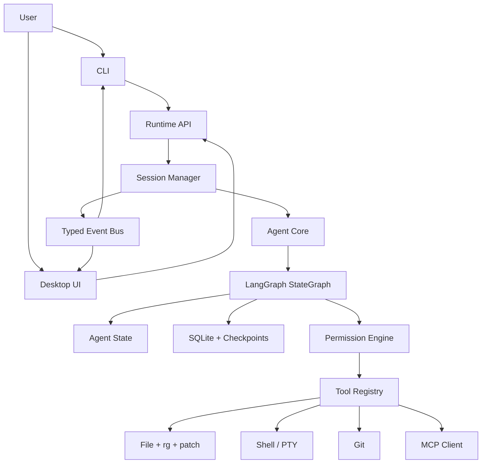
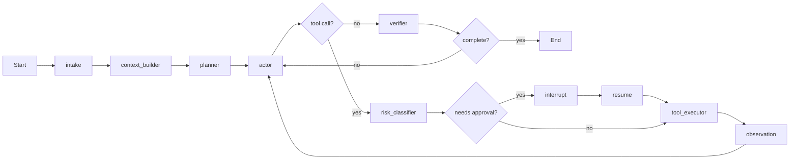

# Code Easy Local Coding Agent Design

Date: 2026-05-26

## Goal

Build `code-easy`, a local TypeScript coding agent inspired by Codex-style terminal workflows and Hermes-style profiles/skills. The product must support a CLI first, then a desktop app, while keeping one shared agent runtime so behavior does not fork between interfaces.

## Current Context

The workspace started as an empty directory at `/Users/viper/work/study/codex/code-easy`. There was no existing package manager, source tree, tests, or Git repository. This design assumes a greenfield TypeScript monorepo.

## Product Shape

The first release is a local programming assistant that can inspect a workspace, propose a plan, edit files through patches, run commands, show diffs, ask for approval before risky actions, persist sessions, and resume work. The CLI is the primary interface for MVP. The desktop app is a second interface over the same runtime and event protocol.

The system should feel closer to a local agent than a chat wrapper:

- Workspace-aware by default.
- Streaming and inspectable while it works.
- Conservative about file writes, shell commands, dependency installation, deletion, and Git operations.
- Able to resume a session through checkpoints.
- Extensible through profiles, skills, and MCP tools.

## Non-Goals For MVP

- No remote multi-user service.
- No autonomous background daemon by default.
- No full IDE extension in the first milestone.
- No browser automation in the first CLI milestone, though the event protocol should leave room for it.
- No custom model training or fine-tuning.

## Architecture Decision

Use a TypeScript monorepo with a shared agent core and separate UI entry points:

- `packages/agent-core`: LangGraph graph, state schema, nodes, model routing.
- `packages/runtime`: session manager, event stream, cancellation, resume, API facade.
- `packages/tools`: file, search, patch, shell, Git, and later MCP/browser tools.
- `packages/storage`: SQLite-backed sessions, events, approvals, and LangGraph checkpoints.
- `packages/permissions`: risk classification and approval policy.
- `packages/ui-protocol`: shared event, command, approval, and IPC schemas.
- `apps/cli`: terminal entry point.
- `apps/desktop`: Electron + React desktop entry point.

The CLI and desktop app must call the same runtime API. They must not embed separate agent logic.

## High-Level Architecture



## LangGraph Runtime

LangGraph is the execution engine because the agent needs explicit state, streaming, checkpoints, and human-in-the-loop interrupts. The runtime should hide LangGraph API details behind internal interfaces so future LangGraph API changes are localized.

Recommended internal state:

```ts
type AgentState = {
  messages: AgentMessage[];
  workspace: WorkspaceContext;
  plan: PlanStep[];
  pendingApproval?: ApprovalRequest;
  toolEvents: ToolEvent[];
  lastError?: AgentError;
  runMode: "chat" | "plan" | "execute" | "review";
};
```

Recommended graph:



Node responsibilities:

- `intake`: normalize user input, load profile instructions, attach workspace metadata.
- `context_builder`: read Git status, project files, local rules, recent session context.
- `planner`: maintain a concrete task plan for non-trivial requests.
- `actor`: choose the next response or tool call.
- `risk_classifier`: classify tool calls before execution.
- `approval_gate`: interrupt the graph when user approval is required.
- `tool_executor`: run tools and emit structured observations.
- `verifier`: decide whether tests, lint, review, or summary are needed before completion.

## Tool System

Tools must be schema-defined, permission-aware, and UI-renderable. Every tool call should have a stable `toolCallId`, `risk`, `input`, `startedAt`, `finishedAt`, and `result`.

MVP tools:

- `read_file`: read bounded text ranges.
- `list_files`: list workspace files using ignore rules.
- `rg_search`: search with ripgrep.
- `apply_patch`: modify files through structured patches.
- `run_command`: run shell commands with timeout and captured output.
- `git_status`: inspect dirty state.
- `git_diff`: show changes.

Later tools:

- `mcp_call`: invoke MCP tools from configured servers.
- `browser_open`, `browser_snapshot`, `browser_click`: UI verification.
- `desktop_automation`: optional local app automation.
- `image_generate`: optional asset generation path.

## Permission Model

The permission engine classifies actions before execution:

| Risk | Examples | Default |
| --- | --- | --- |
| `read` | read files, list files, git status, rg | allow |
| `write` | apply patch, create file | ask |
| `execute` | run tests, start dev server | ask once per command prefix |
| `network` | install dependencies, curl, package manager fetch | ask |
| `destructive` | delete files, reset Git, force push | always ask |
| `external` | open browser, desktop automation, MCP side effects | ask |

Approvals are session-scoped unless the user explicitly grants a reusable rule. Approval records are persisted for auditability.

## Storage

Use SQLite for local persistence:

- `threads`: session metadata and workspace root.
- `messages`: normalized conversational messages.
- `events`: stream events for replay.
- `approvals`: approval requests and decisions.
- `checkpoints`: LangGraph checkpoints keyed by thread id.
- `profiles`: local profile references and selected model provider.

Development can start with in-memory checkpointer only for tests, but the MVP should include SQLite before desktop work begins because desktop depends on resumable sessions.

## Event Protocol

The runtime emits typed events consumed by both CLI and desktop:

```ts
type AgentEvent =
  | { type: "run.started"; runId: string; threadId: string }
  | { type: "message.delta"; runId: string; text: string }
  | { type: "node.started"; runId: string; node: string }
  | { type: "node.completed"; runId: string; node: string }
  | { type: "tool.started"; runId: string; call: ToolCallView }
  | { type: "tool.output"; runId: string; callId: string; chunk: string }
  | { type: "tool.completed"; runId: string; result: ToolResultView }
  | { type: "diff.ready"; runId: string; diff: string }
  | { type: "approval.requested"; runId: string; request: ApprovalRequest }
  | { type: "approval.resolved"; runId: string; decision: ApprovalDecision }
  | { type: "run.completed"; runId: string; summary: string }
  | { type: "run.failed"; runId: string; error: AgentError };
```

The CLI renders this as terminal output. The desktop app renders it as chat messages, tool cards, diff panels, and approval dialogs.

## CLI Design

The CLI should be useful before the desktop app exists.

Commands:

- `code-easy`: start interactive session in current directory.
- `code-easy run "<task>"`: run one task.
- `code-easy resume <threadId>`: resume a session.
- `code-easy sessions`: list local sessions.
- `code-easy approve <approvalId>`: support approval from non-interactive flows.

MVP terminal UI can be simple line-based streaming. A full-screen TUI is optional after the runtime stabilizes.

## Desktop Design

Use Electron + React for the first desktop version. The Electron main process owns local privileged operations and hosts the runtime. The renderer is unprivileged and communicates through typed IPC.

Views:

- Session list.
- Chat/work stream.
- Tool activity timeline.
- Diff viewer.
- Approval queue.
- Settings for model provider, profiles, and MCP servers.

The desktop app should not introduce new agent behavior. It is a richer renderer over the same runtime API.

## Profiles And Skills

Profiles are ordered instruction bundles similar to Hermes-style personas and Codex-style local rules. They should be plain files so users can edit them.

Suggested layout:

```text
.code-easy/
  config.json
  profiles/
    default.md
    architect.md
    implementer.md
  skills/
    react.md
    debugging.md
```

Instruction precedence:

1. System safety rules compiled into the app.
2. Workspace rules discovered from repository files.
3. Selected profile.
4. Selected skill files.
5. Current user request.

The exact precedence should be visible in debug output.

## Model Provider Strategy

Start with an OpenAI-compatible provider interface, not a hard-coded provider. The interface should support streaming chat, tool calling, model selection, and per-run metadata.

Initial adapters:

- OpenAI API.
- OpenAI-compatible local endpoint for vLLM, Ollama-compatible gateways, or other local model servers.

Later adapters:

- Anthropic.
- Google.
- direct Ollama if needed.

## Error Handling

The runtime must distinguish:

- User-cancelled runs.
- Tool timeout.
- Tool denied by policy.
- Tool failed with stderr/exit code.
- Model provider error.
- Graph/checkpoint persistence error.
- Invalid tool call schema.

Recoverable failures should become observations for the actor node. Non-recoverable failures should emit `run.failed` with a concise message and persisted diagnostic details.

## Testing Strategy

Unit tests:

- Tool schemas and validation.
- Permission classification.
- Event protocol validation.
- Storage repositories.
- Graph routing helpers.

Integration tests:

- Read/search/patch flow in a temp workspace.
- Approval interrupt and resume.
- Shell command timeout.
- Git status/diff after patch.
- Checkpoint resume after simulated process restart.

End-to-end tests:

- CLI `run` executes a small code edit in a fixture project.
- Desktop renderer receives mocked event stream and displays approval/diff states.

## Implementation Roadmap

### Phase 1: Project Foundation

Initialize the TypeScript monorepo, package scripts, lint, tests, build pipeline, and shared config.

### Phase 2: Runtime Skeleton

Create typed agent state, event bus, session manager, model provider interface, and a minimal LangGraph flow that can stream a response.

### Phase 3: Tools And Permissions

Implement file/search/patch/shell/Git tools with risk classification and approval interruption.

### Phase 4: CLI MVP

Expose interactive and one-shot CLI modes. Render stream events, tool progress, approval prompts, and final summaries.

### Phase 5: Persistence

Add SQLite-backed session/event/checkpoint storage and session resume.

### Phase 6: Desktop MVP

Add Electron + React shell, typed IPC, session list, stream view, diff viewer, and approval panel.

### Phase 7: Extensibility

Add profiles, skills, MCP client support, model provider configuration, and workspace-local settings.

### Phase 8: Hardening

Add sandbox boundaries, reusable approval rules, command policy tests, cancellation, concurrency controls, and larger fixture-based integration coverage.

## Open Decisions

The following choices are intentionally fixed for MVP unless changed before implementation:

- Package manager: `pnpm`.
- Language: TypeScript, ESM-first.
- Test runner: Vitest.
- Desktop shell: Electron + React.
- Storage: SQLite.
- First UI priority: CLI before desktop.
- First model interface: OpenAI-compatible streaming/tool-calling adapter.

## Research Anchors

- LangGraph JS overview: https://docs.langchain.com/oss/javascript/langgraph/overview
- LangGraph persistence: https://docs.langchain.com/oss/javascript/langgraph/persistence
- LangGraph streaming: https://docs.langchain.com/oss/javascript/langgraph/streaming
- LangGraph interrupts: https://docs.langchain.com/oss/javascript/langgraph/interrupts
- Model Context Protocol TypeScript SDK: https://github.com/modelcontextprotocol/typescript-sdk
- OpenAI Codex CLI: https://github.com/openai/codex
- Hermes Agent: https://github.com/NousResearch/hermes-agent
- OpenHands: https://github.com/OpenHands/OpenHands
- Cline: https://github.com/cline/cline
- aider: https://github.com/Aider-AI/aider
- Continue CLI: https://docs.continue.dev/cli/quickstart

## Spec Self-Review

- Completeness scan: every implementation-facing section has a concrete decision.
- Internal consistency: the CLI and desktop paths both use the same runtime API and event protocol.
- Scope check: this is broad but decomposed into independent implementation phases; Phase 1 through Phase 4 produce a usable CLI MVP before desktop work.
- Ambiguity check: MVP technology choices are fixed above so the implementation plan can be concrete.
